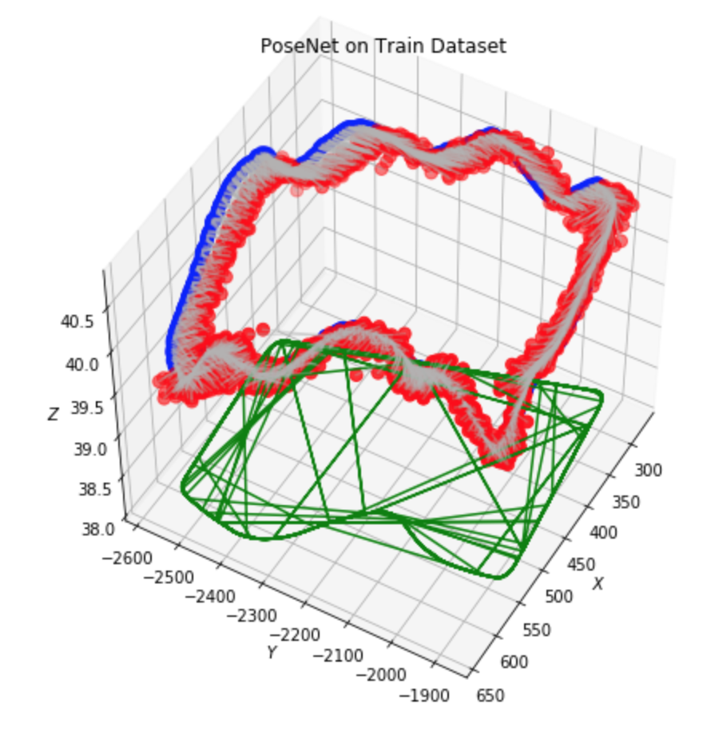
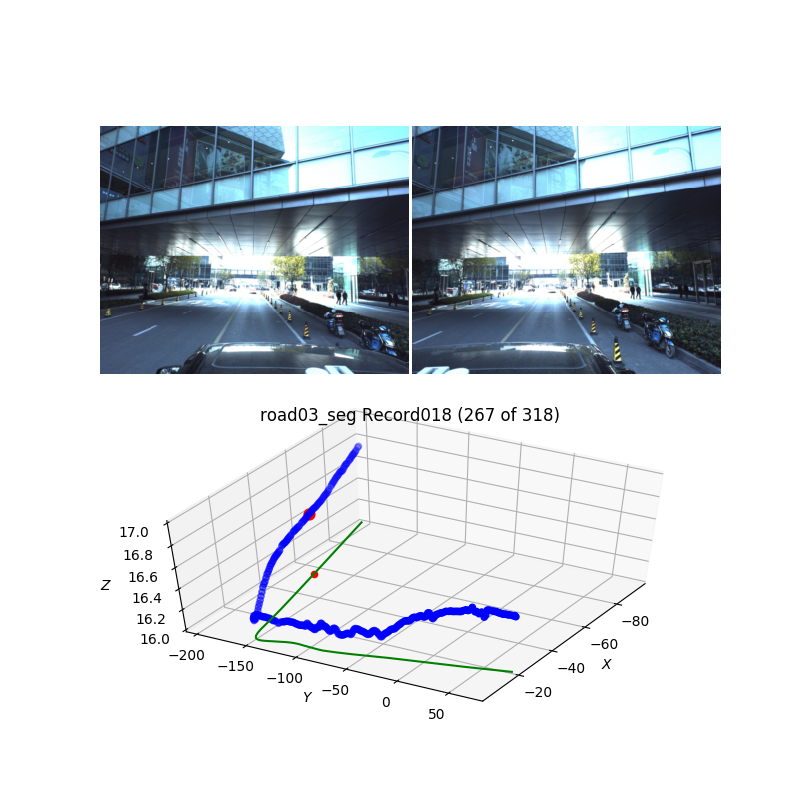
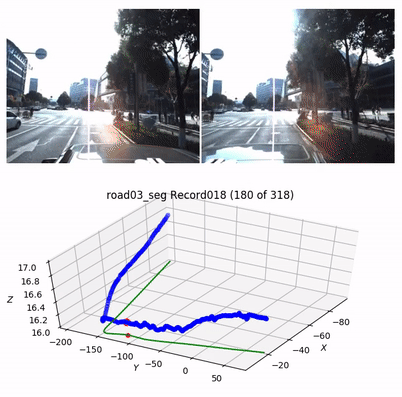
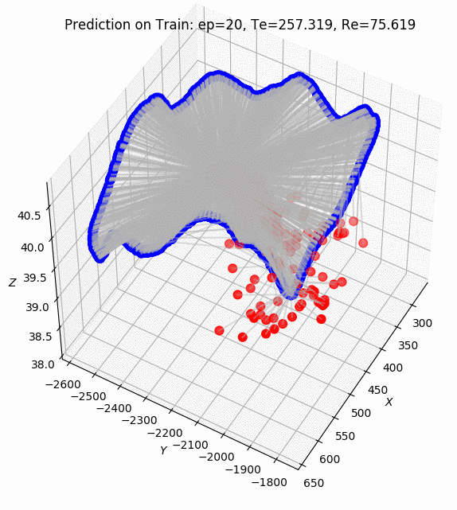
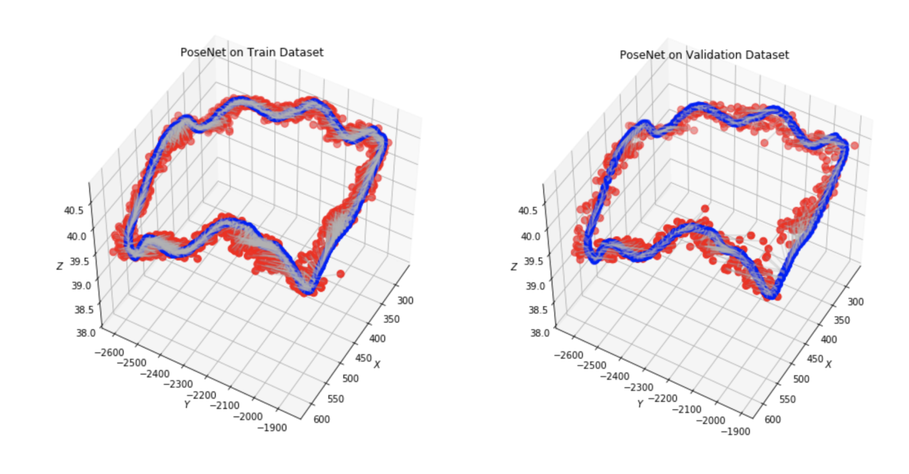

# Apolloscape dataset for localization task.
Exploring localization task on Apolloscape dataset.

Read my blog post about PoseNet implementation details https://capsulesbot.com/blog/2018/08/24/apolloscape-posenet-pytorch.html

ECCV2018 Self-localization on-the-fly [challenge task details](http://apolloscape.auto/ECCV/challenge.html).

__NOTE: This repository is a work in progress.__

# Prerequisites

Dataset reader based on Pytorch 0.4.1 `Dataset`. To install all dependencies:
```
pip install -r requirements.txt
```

# Data

Download Apolloscape data from [page](http://apolloscape.auto/scene.html) and unpack it to a folder. Examples below assume that data folder symbolically linked to `apolloscape-loc/data/apolloscape`.

```
mkdir ./data
ln -s <DATA FOLDER>/apolloscape ./data
```

Sample data file for `zpark` road provided in localization challenge section supported automatically (it has different folder names, files order and pose data files format)

# Python Notebook example

See roads and record graphs in [Apolloscape_View_Records Notebook](./Apolloscape_View_Records.ipynb)

PoseNet training, error calculation and result visualization in [Apolloscape_PoseNet](./Apolloscape_PoseNet.ipynb)



# Show/Save path and sample images by record id

```
python plot_dataset.py --data ./data/apolloscape --road road03_seg --record Record018
```



# Generate video of the path by record id

```
python plot_dataset.py --data ./data/apolloscape --road road03_seg --record Record018 --video
```



# Train PoseNet convnet on ZPark road

```
python train.py --data ./data/apolloscape --road zpark-sample --checkpoint-save 50 --fig-save 1 --epochs 2000 --lr 1e-5 --experiment zpark_posenet_L1 --feature-net resnet34 --feature-net-pretrained --learn-beta
```

Training process:



Training and validation results:




# TODO:
* VidLoc implementation
* [Optional] Prepare data for [eval script](https://github.com/ApolloScapeAuto/dataset-api/tree/master/self_localization)
* SfM / 3D Reconstruction pipeline
* WGAN for generating new samples
* Qt/OpenGL visualizations
